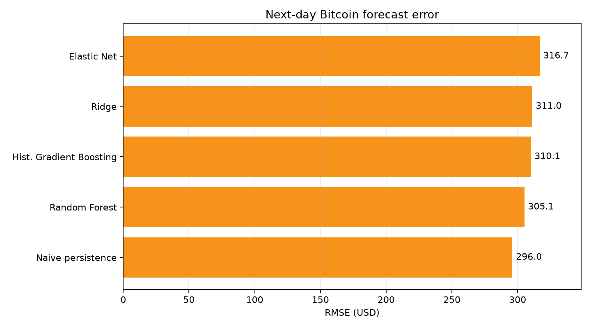
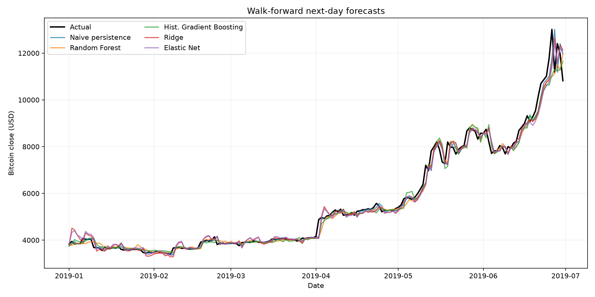

# Bitcoin Next-Day Forecasting

A leakage-aware, reproducible benchmark for predicting the next day's Bitcoin closing price from market history and blockchain-network indicators.

The project compares a persistence baseline with regularized linear models and tree ensembles under a strict expanding-window evaluation. It also preserves the original 2019 research notebooks for historical reference.

## Headline result

**None of the machine-learning models beat the naive baseline on holdout RMSE.** This is the central finding—not a hidden failed experiment. Bitcoin's price persistence makes “tomorrow equals today” a strong baseline, and a model should not be considered useful unless it improves on it out of sample.

| Model | MAE (USD) | RMSE (USD) | MAPE | Direction accuracy |
| --- | ---: | ---: | ---: | ---: |
| **Naive persistence** | **154.06** | **296.00** | **2.24%** | 0.00%¹ |
| Random Forest | 180.98 | 305.13 | 2.84% | 46.41% |
| Histogram Gradient Boosting | 182.30 | 310.09 | 2.81% | 50.83% |
| Ridge | 189.20 | 311.05 | 3.14% | **51.38%** |
| Elastic Net | 193.13 | 316.67 | 3.15% | 49.17% |

¹ The persistence baseline predicts zero movement, so it receives no correct up/down classifications under the strict sign metric.

These results use 181 daily holdout predictions from 2019-01-01 through 2019-06-30. Hyperparameters are selected only from the earlier training period. The committed machine-readable results are in [`outputs/metrics/benchmark.json`](outputs/metrics/benchmark.json).





## Why this project is technically interesting

- **A real baseline:** every model must beat a one-step persistence forecast.
- **No random train/test split:** samples remain in chronological order.
- **Causal features:** a row built from information available on day `t` predicts the close on day `t+1`.
- **Training-only tuning:** `TimeSeriesSplit` selects hyperparameters without exposing the final holdout period.
- **Walk-forward testing:** models are refitted as each newly observed test value becomes available.
- **Reproducible outputs:** one command generates metrics, dated predictions, and portfolio-ready charts.
- **Automated safeguards:** tests check data integrity, next-day target alignment, temporal separation, and evaluation behavior.

## Problem definition

For every date `t`, the benchmark uses price, volume, blockchain indicators, and lagged/rolling transformations known by the end of that date to estimate:

```text
target = Bitcoin closing price on day t + 1
```

The data is split by the date being predicted:

```text
feature history           holdout predictions
2018-01-01 ... 2018-12-31 | 2019-01-01 ... 2019-06-30
                          ^ split date
```

The early observations needed to initialize 30-day rolling features are discarded automatically.

## Data and features

The main modelling file, [`Data/Data_after_EDA.csv`](Data/Data_after_EDA.csv), contains 546 daily observations from 2018-01-01 to 2019-06-30 with no duplicate dates or missing values.

Original variables include:

- Bitcoin closing price and trading volume;
- mining difficulty and hash rate;
- average block size;
- miners' revenue;
- transaction counts and transactions per block;
- cost-per-transaction measures.

The modern pipeline derives:

- 1-, 2-, 3-, 7-, 14-, and 30-day price and return lags;
- 3-, 7-, 14-, and 30-day rolling means and volatility;
- daily volume and blockchain-indicator changes;
- day-of-week and month features.

All rolling statistics are shifted before calculation. This prevents the target day from leaking into its predictors.

See [`Data/`](Data/) for the combined historical files, original spreadsheets, and dataset description. Data provenance and reuse rights should be independently verified before publishing derivative datasets or using them in new research.

## Models

The reproducible benchmark includes:

| Model | Role | Tuning |
| --- | --- | --- |
| Naive persistence | Minimum credible baseline | None |
| Ridge | Stable regularized linear model | L2 strength |
| Elastic Net | Sparse/regularized linear model | Alpha and L1 ratio |
| Random Forest | Non-linear bagged trees | Depth and feature fraction |
| Histogram Gradient Boosting | Non-linear boosted trees | Learning rate and leaf count |

The compact grids are intentional: the dataset is small, and broad searches would increase selection noise without creating more evidence.

## Quick start

Python 3.10 or newer is required.

```bash
python -m venv .venv
```

Activate the environment:

```bash
# macOS/Linux
source .venv/bin/activate

# Windows PowerShell
.venv\Scripts\Activate.ps1
```

Install and run:

```bash
python -m pip install -e ".[dev]"

# Fast smoke run: baseline + Ridge
python -m bitcoin_forecasting --quick

# Full benchmark
python -m bitcoin_forecasting
```

## Refreshing market data

The V2 data pipeline downloads public `BTCUSDT` daily spot candles from Binance's
market-data-only REST endpoint. Dates use UTC and the current, incomplete UTC day
is excluded by default. Existing CSV data is updated incrementally.

```bash
# Download from 2017 through the latest complete UTC day
python -m bitcoin_forecasting.data_cli update

# Validate continuity and OHLC invariants without downloading
python -m bitcoin_forecasting.data_cli validate

# Rebuild a bounded historical snapshot
python -m bitcoin_forecasting.data_cli update --start 2020-01-01 --end 2024-12-31 --full-refresh
```

The default cache is `data/raw/market/btcusdt_1d.csv`; a versioned
`dataset_manifest.json` records its source, coverage, and SHA-256 checksum. Use
`--parquet` to also create a Parquet copy when `pyarrow` is installed. The legacy
2018–2019 modelling dataset remains supported by the original benchmark command.

The forecasting pipeline accepts both the legacy schema and the refreshed OHLCV
schema. After updating, run a recent holdout directly with:

```bash
python -m bitcoin_forecasting \
  --data data/raw/market/btcusdt_1d.csv \
  --split-date 2026-01-01 \
  --quick
```

Alternatively, `requirements.txt` contains the same runtime and test dependencies for environments that do not install the project as a package; in that case set `PYTHONPATH=src` before invoking the module.

Useful options:

```bash
python -m bitcoin_forecasting --help
python -m bitcoin_forecasting --models ridge random_forest
python -m bitcoin_forecasting --split-date 2019-01-01 --output-dir outputs
```

## Generated artifacts

Each run creates:

```text
outputs/
├── metrics/benchmark.json
├── predictions/<model>.csv
└── figures/
    ├── model_comparison.png
    └── predictions.png
```

Prediction CSVs include `target_date`, the previous close, actual close, and forecast, which makes every score auditable.

## Testing

```bash
python -m pytest -q
```

The current suite contains six tests covering:

- required columns, missing values, date ordering, and duplicates;
- exact alignment of day-`t` predictors with the day-`t+1` target;
- non-overlapping chronological train/test periods;
- invalid split rejection;
- persistence-baseline behavior;
- expanding-window prediction behavior.

GitHub Actions runs the tests and a quick end-to-end training smoke test on each push and pull request.

## Project structure

```text
.
├── src/bitcoin_forecasting/
│   ├── data.py          # loading, validation, chronological split
│   ├── features.py      # causal lag and rolling features
│   ├── models.py        # reproducible estimators and search grids
│   ├── evaluation.py    # tuning, walk-forward evaluation, metrics
│   ├── reporting.py     # JSON, CSV, and chart generation
│   └── cli.py           # command-line workflow
├── tests/               # data and evaluation safeguards
├── outputs/             # benchmark results and figures
├── Data/                # source and processed datasets
├── Data Processing/     # original exploratory notebooks
├── Models/              # original model notebooks
├── pyproject.toml
└── requirements.txt
```

## Legacy experiments

The original notebooks cover EDA, ARIMA, Bayesian Ridge, Ridge, Lasso, Elastic Net, SVR, decision trees, MLP, LSTM, and GRU. They are retained to show the research history, but they are not part of the supported execution path.

Notable limitations in the archived work include absolute paths, missing `Functions_1.py` and `LSTM_Dataset.csv`, obsolete library APIs, inconsistent evaluation windows, and incomplete exploratory notebooks. The modern `src/` pipeline replaces those fragile execution paths while preserving the source material.

Recommended historical entry points:

- [`Data Processing/Exploratory Data Analysis.ipynb`](Data%20Processing/Exploratory%20Data%20Analysis.ipynb)
- [`Models/ARIMA.ipynb`](Models/ARIMA.ipynb)
- [`Models/Ridge.ipynb`](Models/Ridge.ipynb)
- [`Models/Deep_Learning.ipynb`](Models/Deep_Learning.ipynb)

## Interpretation and next steps

The benchmark suggests that the available daily blockchain indicators and engineered historical features do not produce a robust RMSE improvement over price persistence during this holdout period. Ridge slightly exceeds chance on direction, but that result alone is not evidence of a profitable strategy.

Useful next experiments would be:

1. predict next-day log return rather than the non-stationary price level;
2. repeat evaluation across multiple market regimes instead of one six-month holdout;
3. test whether blockchain features add value over a price-history-only ablation;
4. add transaction costs and a no-trade threshold before discussing strategy performance;
5. quantify uncertainty with prediction intervals.

## Disclaimer

This project is for educational and research purposes only. Its forecasts are not financial advice and should not be used as the sole basis for trading or investment decisions.
