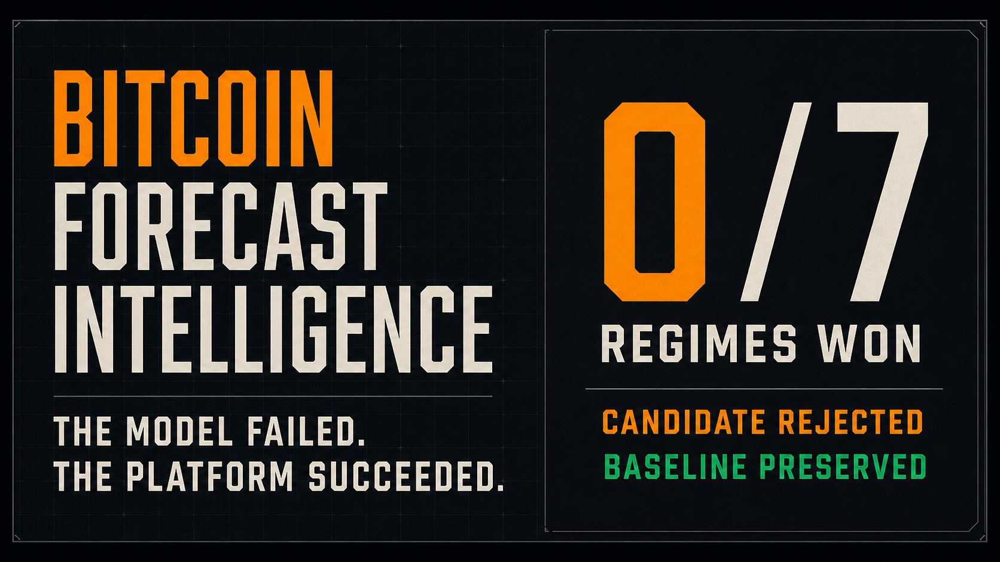
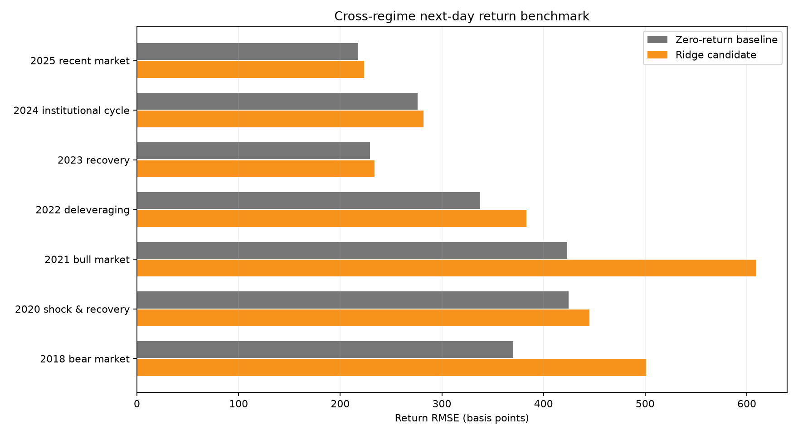
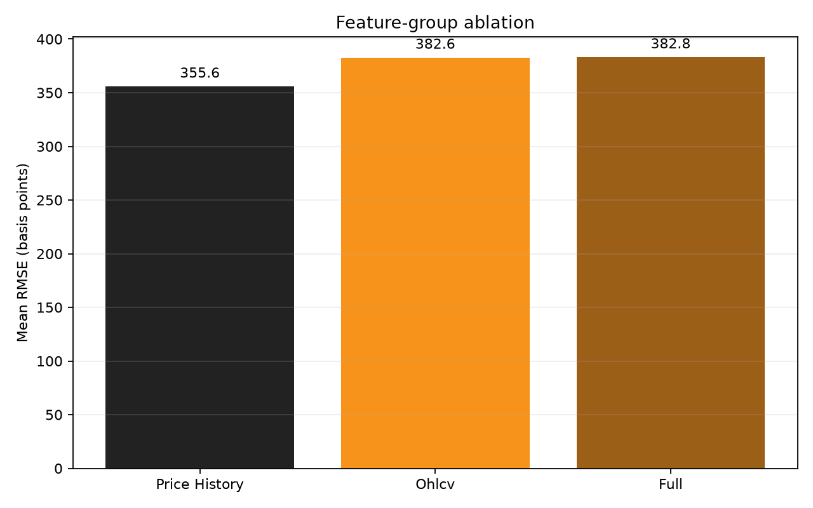

# Bitcoin Forecast Intelligence Platform

A reproducible time-series research platform that turns governed Bitcoin market
history into leakage-safe features, cross-regime model evidence, explicit release
decisions, and an interview-ready interactive case study.

[](https://andy-junxiong.github.io/Bitcoin-Time-Series-Modelling-And-Evaluation/)

<p align="center">
  <a href="https://andy-junxiong.github.io/Bitcoin-Time-Series-Modelling-And-Evaluation/"><strong>Explore the interactive case study →</strong></a>
  &nbsp;·&nbsp;
  <a href="docs/platform-architecture.md">Platform architecture</a>
  &nbsp;·&nbsp;
  <a href="docs/model-release-multi-regime.md">Model release evidence</a>
</p>

> The platform is a research and model-governance case study. It is not a
> trading system, investment recommendation, profitability claim, or live
> portfolio-allocation service.

## Results at a glance

| Platform evidence | Result |
| --- | ---: |
| Governed market coverage | **3,261 complete UTC days** |
| Coverage period | **2017-08-17 → 2026-07-21** |
| Leakage-safe feature rows | **3,229** |
| Declared market regimes | **7** |
| Candidate wins over zero-return baseline | **0/7** |
| Mean candidate RMSE improvement | **-14.88%** |
| Mean direction accuracy | **50.63%** |
| Release decision | **Rejected — baseline preserved** |
| Automated Python tests | **13/13 passed** |

The negative result is intentional first-class evidence. The Ridge next-day
log-return candidate did not earn promotion, so the versioned release gate
rejected it and retained the zero-return baseline.

## What the platform does

```text
Binance complete UTC candles
        ↓
Raw market cache + SHA-256 manifest
        ↓
Validated daily market contract
        ↓
Leakage-safe feature snapshot
        ↓
Seven expanding-history regime backtests
        ↓
Feature ablation + model release gate
        ↓
Candidate rejected or promoted by policy
```

- Downloads bounded `BTCUSDT` daily candles with incremental updates.
- Excludes the current incomplete UTC day.
- Validates continuity, uniqueness, numeric values, and OHLC invariants.
- Records source coverage and a SHA-256 checksum in a dataset manifest.
- Builds day-`t` features that predict day `t+1` without future leakage.
- Evaluates a stationary next-day log-return target across named market regimes.
- Compares the candidate against an auditable zero-return baseline.
- Measures whether price history, OHLCV, or all available features add value.
- Applies a versioned promotion policy and preserves the baseline on failure.
- Generates machine-readable evidence, charts, documentation, and a portfolio site.

## Decision boundary

The platform answers:

- Is the daily source history complete and contract-valid?
- Does a return model beat a zero-return baseline across different regimes?
- Do additional OHLCV inputs improve on price-history-only features?
- Is the evidence strong enough to promote a candidate?

It does not:

- recommend buying, selling, or holding Bitcoin;
- model transaction costs, leverage, liquidity, or portfolio constraints;
- claim causal relationships between features and returns;
- guarantee that other horizons, sources, or model classes cannot work;
- publish an unapproved candidate as a production forecast.

## Repository map

| Path | Purpose |
| --- | --- |
| [`src/bitcoin_forecasting/`](src/bitcoin_forecasting/) | Data loading, validation, feature engineering, modelling, evaluation, and reporting |
| [`src/bitcoin_forecasting/research.py`](src/bitcoin_forecasting/research.py) | Cross-regime return benchmark, ablation, and release decision |
| [`contracts/`](contracts/) | Versioned daily-market data contract |
| [`governance/`](governance/) | Candidate promotion policy and failure behavior |
| [`docs/`](docs/) | Platform architecture and model-release evidence |
| [`outputs/platform/`](outputs/platform/) | Committed multi-regime metrics, ablation evidence, and figures |
| [`interview-site/`](interview-site/) | Interactive portfolio case study and social preview |
| [`tests/`](tests/) | Data, leakage, evaluation, market-download, and release-gate tests |
| [`Data/`](Data/) | Original research data and historical source files |
| [`Data Processing/`](Data%20Processing/) | Preserved exploratory notebooks and scripts |
| [`Models/`](Models/) | Preserved historical model experiments |

## Governed market data

The V2 data pipeline uses public Binance `BTCUSDT` daily spot candles. Dates are
UTC, and the current incomplete UTC day is excluded by default.

```bash
# Download from the requested start through the latest complete UTC day
python -m bitcoin_forecasting.data_cli update

# Validate an existing market cache without downloading
python -m bitcoin_forecasting.data_cli validate

# Rebuild a bounded historical snapshot
python -m bitcoin_forecasting.data_cli update \
  --start 2020-01-01 \
  --end 2024-12-31 \
  --full-refresh
```

The default local cache is:

```text
data/raw/market/
├── btcusdt_1d.csv
└── dataset_manifest.json
```

The CSV and optional Parquet files are intentionally ignored by Git. The
manifest records source, symbol, interval, timezone, coverage, row count, and
SHA-256 checksum. CI uses deterministic synthetic fixtures rather than relying
on a mutable external download.

The governing schema and invariants are declared in
[`contracts/market_daily.v1.json`](contracts/market_daily.v1.json).

## Leakage-safe feature product

For each row at day `t`, the platform predicts:

```text
target_log_return = log(close[t+1] / close[t])
```

Available feature families include:

- 1-, 2-, 3-, 7-, 14-, and 30-day price and return lags;
- 3-, 7-, 14-, and 30-day rolling price means and volatility;
- lagged return volatility;
- open, high, low, close, base volume, quote volume, and trade count;
- daily volume change;
- day-of-week and month.

Rolling statistics are shifted before calculation. No predictor uses a negative
shift, target value, target date, or future-derived aggregate.

## Cross-regime model evidence

Run the governed research workflow with:

```bash
python -m bitcoin_forecasting.research
```

The candidate is a standardized Ridge model with `alpha=10`. The baseline
predicts zero next-day log return. Each fold fits on all feature rows strictly
before the declared regime.

| Regime | Baseline RMSE | Candidate RMSE | Improvement | Direction accuracy |
| --- | ---: | ---: | ---: | ---: |
| 2018 bear market | 370.2 bps | 501.0 bps | -35.3% | 50.00% |
| 2020 shock and recovery | 424.8 bps | 445.3 bps | -4.8% | 50.27% |
| 2021 bull market | 423.2 bps | 609.2 bps | -44.0% | 50.14% |
| 2022 deleveraging | 337.8 bps | 383.3 bps | -13.5% | 48.77% |
| 2023 recovery | 229.2 bps | 233.9 bps | -2.0% | 52.88% |
| 2024 institutional cycle | 276.2 bps | 281.9 bps | -2.1% | 51.37% |
| 2025 recent market | 217.8 bps | 223.3 bps | -2.5% | 50.96% |



## Feature ablation

The ablation asks whether adding more contemporaneous market fields creates
stable incremental signal.

| Feature group | Features | Regimes won | Mean RMSE improvement |
| --- | ---: | ---: | ---: |
| Price history | 28 | 1/7 | -7.60% |
| Price + OHLCV | 35 | 0/7 | -14.88% |
| All available | 36 | 0/7 | -14.95% |



Price history alone lost less badly than the larger feature groups. The result
does not support promoting the current OHLCV candidate.

## Model release gate

The promotion policy requires:

1. candidate RMSE must beat the zero-return baseline in at least 60% of regimes;
2. mean RMSE improvement across all declared regimes must be positive.

Observed evidence:

```text
required regime wins: 5 / 7
observed regime wins: 0 / 7
mean RMSE improvement: -14.88%
decision: REJECTED
baseline: PRESERVED
```

The versioned policy is stored in
[`governance/return_model_release_policy.json`](governance/return_model_release_policy.json).
The dated interpretation is documented in
[`docs/model-release-multi-regime.md`](docs/model-release-multi-regime.md).

## Original price-level benchmark

The modern platform preserves the earlier 2019 next-day closing-price benchmark
as historical evidence.

| Model | MAE (USD) | RMSE (USD) | MAPE | Direction accuracy |
| --- | ---: | ---: | ---: | ---: |
| **Naive persistence** | **154.06** | **296.00** | **2.24%** | 0.00% |
| Random Forest | 180.98 | 305.13 | 2.84% | 46.41% |
| Histogram Gradient Boosting | 182.30 | 310.09 | 2.81% | 50.83% |
| Ridge | 189.20 | 311.05 | 3.14% | **51.38%** |
| Elastic Net | 193.13 | 316.67 | 3.15% | 49.17% |

The persistence baseline predicts no movement, so it receives no correct
up/down classifications under the strict sign metric. None of the machine
learning models beat persistence on holdout RMSE.

These results use 181 holdout predictions from 2019-01-01 through 2019-06-30.
Hyperparameters are selected only from the earlier training period.

## Quick start

Python 3.10 or newer is required.

```bash
python -m venv .venv
```

Activate the environment:

```bash
# macOS/Linux
source .venv/bin/activate

# Windows PowerShell
.venv\Scripts\Activate.ps1
```

Install and run:

```bash
python -m pip install -e ".[dev]"

# Validate the test suite
python -m pytest -q

# Run the original baseline + Ridge smoke benchmark
python -m bitcoin_forecasting --quick

# Run the full original price benchmark
python -m bitcoin_forecasting

# Generate cross-regime evidence and the release decision
python -m bitcoin_forecasting.research
```

Installed command aliases:

```bash
bitcoin-data validate
bitcoin-forecast --quick
bitcoin-research
```

## Generated artifacts

The original price benchmark writes:

```text
outputs/
├── metrics/benchmark.json
├── predictions/<model>.csv
└── figures/
    ├── model_comparison.png
    └── predictions.png
```

The platform research workflow writes:

```text
outputs/platform/
├── platform_summary.json
├── regime_metrics.csv
├── regime_predictions.csv
├── ablation.csv
└── figures/
    ├── regime_comparison.png
    └── feature_ablation.png
```

Detailed prediction files are ignored by Git to avoid noisy diffs. Compact
metrics, release evidence, and final figures are committed for auditability.

## Testing and continuous delivery

```bash
python -m pytest -q
```

The suite covers:

- required columns, missing values, ordering, and duplicate dates;
- exact day-`t` to day-`t+1` target alignment;
- chronological train/test separation;
- persistence-baseline and expanding-window behavior;
- complete-day market-data handling and pagination;
- daily continuity and OHLC validation;
- V2 OHLCV feature generation;
- nested feature-ablation groups;
- cross-regime training boundaries;
- explicit release-gate decisions.

GitHub Actions runs all Python tests and a quick end-to-end training smoke test
on pushes and pull requests. A separate workflow builds and publishes the
interactive case study to GitHub Pages.

## Interactive portfolio case study

The public presentation is available at:

**[andy-junxiong.github.io/Bitcoin-Time-Series-Modelling-And-Evaluation](https://andy-junxiong.github.io/Bitcoin-Time-Series-Modelling-And-Evaluation/)**

The case study presents:

- decision questions rather than a chart gallery;
- governed source and feature evidence;
- all seven regime results;
- feature ablation;
- the failed-candidate story;
- the release gate and preserved baseline;
- the end-to-end platform architecture.

The implementation lives in [`interview-site/`](interview-site/) and is
automatically deployed by
[`.github/workflows/deploy-showcase-pages.yml`](.github/workflows/deploy-showcase-pages.yml).

## Legacy research

The original notebooks cover EDA, ARIMA, Bayesian Ridge, Ridge, Lasso, Elastic
Net, SVR, decision trees, MLP, LSTM, and GRU. They are retained as historical
research evidence but are not part of the supported execution path.

Known limitations in the archived work include:

- absolute local paths;
- missing historical helper files and datasets;
- obsolete library APIs;
- inconsistent evaluation windows;
- incomplete exploratory notebooks.

Recommended historical entry points:

- [`Data Processing/Exploratory Data Analysis.ipynb`](Data%20Processing/Exploratory%20Data%20Analysis.ipynb)
- [`Models/ARIMA.ipynb`](Models/ARIMA.ipynb)
- [`Models/Ridge.ipynb`](Models/Ridge.ipynb)
- [`Models/Deep_Learning.ipynb`](Models/Deep_Learning.ipynb)

## Methodological limitations

- Binance spot history represents one venue and one `BTCUSDT` market.
- Daily bars hide intraday structure, order-book state, and execution conditions.
- Regime labels are declared research windows, not causal market-state estimates.
- The current candidate uses compact engineered features and a single linear model.
- Direction accuracy near 50% is not evidence of economic value.
- No transaction costs, slippage, position sizing, or capital constraints are modelled.
- The platform does not yet produce calibrated prediction intervals.
- The source dataset and provider terms should be reviewed independently before redistribution.

## Suggested next steps

- evaluate weekly and multi-day forecast horizons;
- add externally sourced macro, derivatives, and blockchain features;
- introduce conformal or quantile prediction intervals;
- compare candidates using nested time-aware model selection;
- add transaction-cost-aware decision thresholds;
- close the loop with forecast-to-actual monitoring and immutable release archives.

## Disclaimer

This project is for educational and research purposes only. Its forecasts,
metrics, and visualizations are not financial advice and should not be used as
the sole basis for investment or trading decisions.

## License

No license file is currently included. Unless a license is added, the code and
written material remain under default copyright terms. External source data is
governed separately by its provider.
